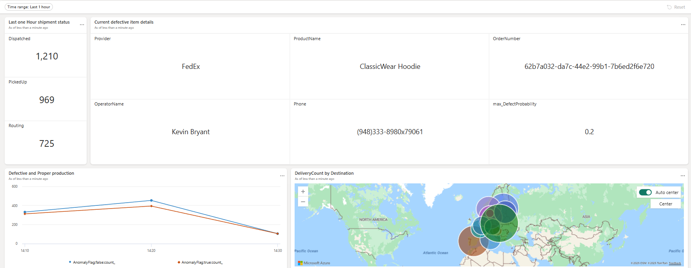

# Take Control

## Backstory
Fabrikam's immediate requirement is to control the spread of bad reputation through defective production and shipping these defective products to their customers. For this, they need your help to work on previously gathered data and make actionable insights available to all the management and operational teams.

## Setup
For running this Act, 
1. You will need knowledge of Kusto Query Language (KQL).
2. You will need to access to create a Fabric Activator and Real-Time Dashboard.

## Challenges 

## 1. Get Latest Shipping details
    Hint: Use update policy to parse xml into silver table
    Hint: Use Materialized View to get latest details for each productId

## 2. Stop the shipping providers  and production line that is carrying the highest defect probability product for every 1 hour
    Hint : Use a combination of the following steps to achieve this
    1. Join between product, operators, shipment, shipping provider, and production
    2. Create Alert on the query with details of  OrderNumber , ProductName, ShippingProvider , PhoneNumber of the provider, Operator Name and phone Number
    3. Activator limiting to 5 details? Try combining OrderNumber and ProductName in KQL query into one column [OrderNumber - ProductName]

## 3. Create an operational dashboard for Fabrikam management
1. Show  all operators details.
    
    Hint: Use copilot dashboard creation from Real-Time Hub

2. Correlation between defective and non-defective products in 1 hour bins

    Hint: Use copilot to get this query

3. Current shipment status (count of orders by status). 
4. Map showing shipment count by destination

* Below is an example of an operational dashboard for Fabrikam management
