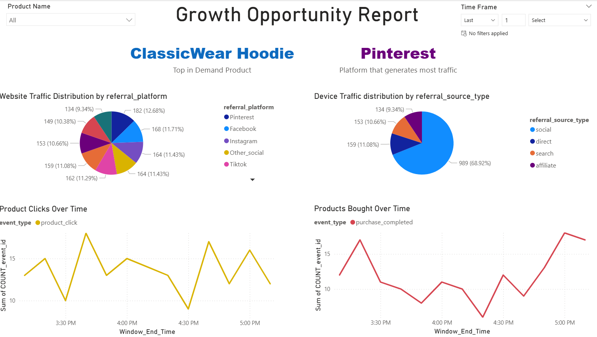

# Every click counts

## Backstory
Thank you for helping Fabrikam take control of it's issues in the last Act. Now, we are ready to look at the demand, and adjust our supply chain accordingly. Fabrikam is getting a huge number of orders due to sudden surge in demand after some celebrities posted about our products on their social media handles. We want to capture clickstream data through various sources, analyze it and take actions to maximize our revenue.

## Setup
For running this Act, 
1. New Eventstream that captures clickstream data.
2. Use the attached "Clickstream Simulator" notebook to generate clickstream data. The notebook will generate data and push it to an Eventstream that you can configure.
3. Knowledge of Kusto Query Language (KQL) to analyze the data.
4. Data Factory to create pipelines.
5. Power BI to create reports.

## Challenges 

<!--
## Create schema registry for Clickstream data using below details
    Hint: Use Event Schema set and create columns as below
    event_id string, timestamp string, event_type string, user_id string, session_id string, sku string, country string,
    country_code string, client_info dynamic, click_path dynamic, referral_source_type string, referral_platform string, product_id string
    Hint: Make sure to associate the schema set to Eventstream custom endpoint
-->

## 1.Filter Clickstream data for US traffic only and aggregate total clicks by product and website for 10 minutes
<!-- Hint:  Make sure to associate Schema to the stream. -->
    Hint: Use filter transformation to filter origin country
    Hint: Group by data for every 10 minutes per product, event_type, sku, country, country_code, referral_source_type, referral_platform and Product_id 

## 2.Increase the cost of top 3 most demanded products of all time by 15% each day
    Hint: Use the power of KQL to find top 3 products using SKU
    Hint: You can update tables in KQL
    Hint: Setup everyday pipeline to run updates

## 3. Create a “Growth Opportunity” Report
1. Create a Power BI report that shows the following information
2. Filters – Time, and Products
3. Card Visuals – In-demand product, Website with Highest traffic
4. Time charts - Product clicks over time, Products bought over time
5. Pie charts – Website traffic distribution, Device traffic distribution

    Hint: Create a new black Power Bi report and build all the visuals there.
    Hint: You`ll need to create measures for In demand Products and Highest Traffic. Here is an example of how the "Growth Opportunity" Report looks like

